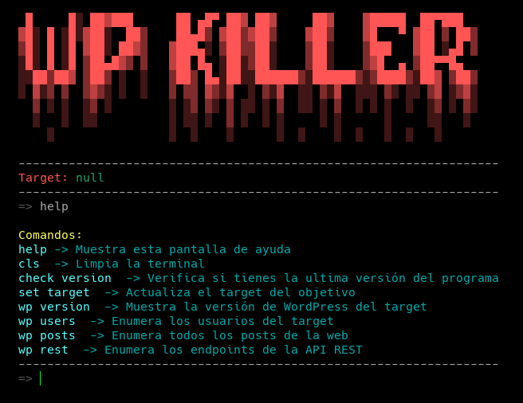

# Nueva versión de WpKiller (v0.2)

Después de 2 semanas, la versión v0.2 de WpKiller ya está disponible para Windows y Linux.

### Notas de la versión:

- Se rediseñó por completo la interfaz.
- Se agregó la opción de verificar si hay una nueva versión del programa disponible.
- Ahora es compatible con Windows `.exe` sin necesidad de tener Python instalado.

##### Instalación: [https://github.com/k4ixer/WpKiller](https://github.com/k4ixer/WpKiller)
